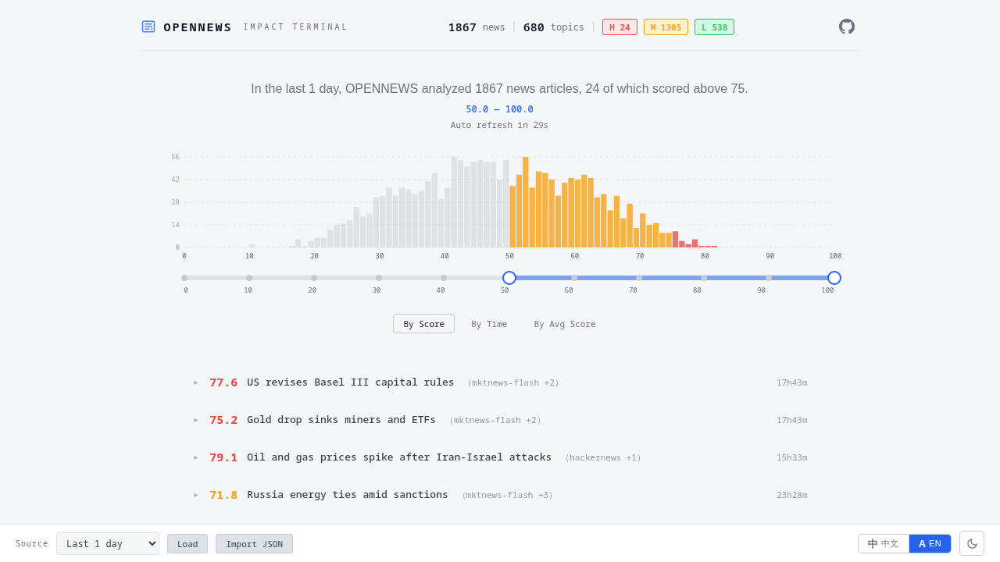

<div align="center">

# OpenNews

实时金融新闻知识图谱与影响评分系统。

[](https://www.python.org/downloads/)
[](LICENSE)
[](README.md)

</div>

---

<p align="center">
  
</p>

## 目录

- [概述](#概述)
- [流水线](#流水线)
- [Docker 快速开始](#docker-快速开始)
- [本地安装与运行](#本地安装与运行)
- [Web API](#web-api)
  - [分享截图 API（PNG）](#分享截图-apipng)
- [配置](#配置)
- [新闻输入](#新闻输入)
- [项目结构](#项目结构)
- [许可证](#许可证)

## 概述

OpenNews 是一个基于 LangGraph 的金融新闻分析流水线。
系统自动抓取多源新闻，执行 NLP 与影响评分，并将结果写入 PostgreSQL 与 Neo4j，同时提供实时 Web 面板用于筛选和查看详情。

### 功能亮点

- 多源新闻接入（NewsNow API + JSONL 种子）
- FinBERT 向量化 + 在线主题聚类
- DeBERTa 零样本分类
- 7 维特征提取
- DK-CoT 影响评分（`0-100`）
- Redis 时序记忆窗口
- 中英双语主题标签（失败自动重试）
- Web 面板 + 分享截图生成功能

## 流水线

```text
重试标签翻译 → 抓取新闻 → 嵌入 → 实体抽取 ─┬→ 主题聚类 ──────┐
                                             ├→ 零样本分类 ────┤
                                             └→ 特征提取 ──────┘
                                                     ↓
                                               构建载荷 → 输出文件
                                                     ↓
                                               记忆写入 → 趋势更新
                                                     ↓
                                                 报告生成 → 图谱写入 → END
```

## Docker 快速开始

> 首次使用推荐 Docker。

```bash
# 启动全栈（PostgreSQL + Neo4j + Redis + backend + web）
docker compose -f docker/docker-compose.yml up -d

# 查看状态
docker compose -f docker/docker-compose.yml ps

# 查看后端日志
docker compose -f docker/docker-compose.yml logs -f backend

# 停止
docker compose -f docker/docker-compose.yml down
```

Web 面板地址：`http://localhost:8080`（可通过 `WEB_PORT` 修改）。

## 本地安装与运行

```bash
git clone https://github.com/user/opennews.git && cd opennews
python3.10 -m venv .venv
source .venv/bin/activate

# CPU 版 torch 需要走 PyTorch 索引
pip install --extra-index-url https://download.pytorch.org/whl/cpu -r requirements.txt
```

如果你要在本地使用 PNG 分享截图 API，请额外安装浏览器运行时：

```bash
pip install playwright
playwright install chromium
```

### 本地运行（应用进程不走 Docker）

```bash
# 基础设施（示例）
docker run -d --name opennews-pg -p 5432:5432 -e POSTGRES_PASSWORD=123456 -e POSTGRES_DB=opennews postgres:16-alpine
docker run -d --name opennews-neo4j -p 7474:7474 -p 7687:7687 -e NEO4J_AUTH=neo4j/Aa123456 neo4j:5-community
docker run -d --name opennews-redis -p 6379:6379 redis:7-alpine

# 启动流水线
PYTHONPATH=src python -m opennews.main

# 构建前端
cd web && npm install && npx vite build && cd ..

# 启动 Web 服务
PYTHONPATH=src python web/server.py --port 8080
```

## Web API

### 核心数据接口

| 接口 | 说明 |
|---|---|
| `GET /api/batches` | 列出所有批次 |
| `GET /api/batches/latest` | 获取最新批次记录 |
| `GET /api/batches/<id>` | 按批次 ID 获取记录 |
| `GET /api/records?hours=N&page=P&score_lo=X&score_hi=Y` | 按时间和分数区间查询记录 |

### 分享截图 API（PNG）

`GET /api/share/default`

返回 **PNG 图片**（`Content-Type: image/png`），排版与前端分享卡片一致。

#### 查询参数

| 参数 | 类型 | 默认值 | 说明 |
|---|---:|---:|---|
| `hours` | float | `24` | 时间窗口（小时，`0.1 ~ 8760`） |
| `score_lo` | float | `50` | 分数下界（`0 ~ 100`） |
| `score_hi` | float | `100` | 分数上界（`0 ~ 100`） |
| `lang` | string | `zh` | `zh` 或 `en` |
| `limit` | int | `5` | 热门主题条数（`1 ~ 50`） |
| `width` | int | `390` | 卡片宽度（`200 ~ 1200`） |
| `pixel_ratio` | float | `2` | 输出缩放（`0.5 ~ 4`） |
| `background` | string | `#f5f6f8` | 卡片背景色 |
| `cache` | bool | `true` | 是否读写缓存 |
| `refresh` | bool | `false` | 是否强制重绘并刷新缓存 |

#### 缓存行为

- `refresh=true`：始终重绘。
- `cache=true` 且 `refresh=false`：优先走内存/磁盘缓存。
- `cache=false&refresh=false`：仅本次绘制，不读不写缓存。

#### 调用示例

```bash
# 默认参数
curl "http://localhost:8080/api/share/default" -o share.png

# 英文 + 自定义筛选
curl "http://localhost:8080/api/share/default?lang=en&hours=48&score_lo=60&score_hi=95&limit=3" -o share-en.png

# 强制刷新
curl "http://localhost:8080/api/share/default?refresh=true" -o share-fresh.png
```

## 配置

所有配置都支持环境变量覆盖。

### 核心配置

| 环境变量 | 默认值 | 说明 |
|---|---|---|
| `NEWS_POLL_INTERVAL_MIN` | `5` | 轮询间隔（分钟） |
| `BATCH_SIZE` | `32` | 每轮最大抓取条数 |
| `EMBEDDING_MODEL` | `ProsusAI/finbert` | 嵌入模型 |
| `NER_MODEL` | `dslim/bert-base-NER` | NER 模型 |
| `CLASSIFIER_MODEL` | `MoritzLaurer/DeBERTa-v3-base-mnli-fever-anli` | 零样本分类模型 |
| `REDIS_URL` | `redis://127.0.0.1:6379/0` | Redis 连接地址 |
| `MEMORY_WINDOW_DAYS` | `30` | 时序记忆窗口 |
| `PG_HOST` / `PG_PORT` / `PG_USER` / `PG_PASSWORD` / `PG_DATABASE` | `127.0.0.1` / `5432` / `postgres` / `123456` / `opennews` | PostgreSQL |
| `NEO4J_URI` / `NEO4J_USER` / `NEO4J_PASSWORD` | `bolt://127.0.0.1:7687` / `neo4j` / `Aa123456` | Neo4j |
| `LLM_API_KEY` / `LLM_BASE_URL` / `LLM_MODEL` | — / — / `gpt-4o-mini` | 主题精炼 LLM |

### 分享接口配置

| 环境变量 | 默认值 | 说明 |
|---|---|---|
| `SHARE_API_ENABLED` | `true` | 是否启用 `/api/share/default` |
| `SHARE_SCHEDULER_ENABLED` | `true` | 是否启用默认图定时预热 |
| `SHARE_REFRESH_MINUTES` | `30` | 默认图缓存刷新周期 |
| `SHARE_DEFAULT_HOURS` | `24` | 默认 `hours` |
| `SHARE_DEFAULT_SCORE_LO` | `50` | 默认 `score_lo` |
| `SHARE_DEFAULT_SCORE_HI` | `100` | 默认 `score_hi` |
| `SHARE_DEFAULT_LANG` | `zh` | 默认语言 |
| `SHARE_DEFAULT_LIMIT` | `5` | 默认主题条数 |
| `SHARE_DEFAULT_WIDTH` | `390` | 默认输出宽度 |
| `SHARE_DEFAULT_PIXEL_RATIO` | `2` | 默认输出缩放 |
| `SHARE_DEFAULT_BACKGROUND` | `#f5f6f8` | 默认背景色 |
| `SHARE_CACHE_DIR` | `data/share` | PNG 缓存目录 |
| `SHARE_RENDER_TIMEOUT_MS` | `15000` | 渲染超时（毫秒） |

## 新闻输入

### NewsNow API

在 `config/sources.yaml` 中配置：

```yaml
newsnow:
  - url: https://newsnow.busiyi.world/api/s/entire
    sources:
      - wallstreetcn-news
      - cls-telegraph
      - 36kr-quick
```

### JSONL 种子文件

向 `seeds/realtime_seeds.jsonl` 追加，每行一个 JSON：

```jsonl
{"news_id":"seed-001","title":"美联储暗示放缓降息","content":"官员们在通胀粘性背景下发出谨慎信号。","source":"seed","url":"seed://seed-001","published_at":"2026-03-09T07:30:00+00:00"}
```

## 项目结构

```text
opennews/
├── src/opennews/            # 流水线、数据库、图谱、NLP、调度
├── web/                     # 前端 + web/server.py
├── config/                  # llm.yaml, sources.yaml
├── docker/                  # compose 与数据卷
├── seeds/                   # JSONL 种子新闻
├── build.sh                 # 一键启动脚本
├── db-clean.sh              # 数据清理脚本
└── requirements.txt
```

## 许可证

MIT

## 社区

- [LinuxDO](https://linux.do)
